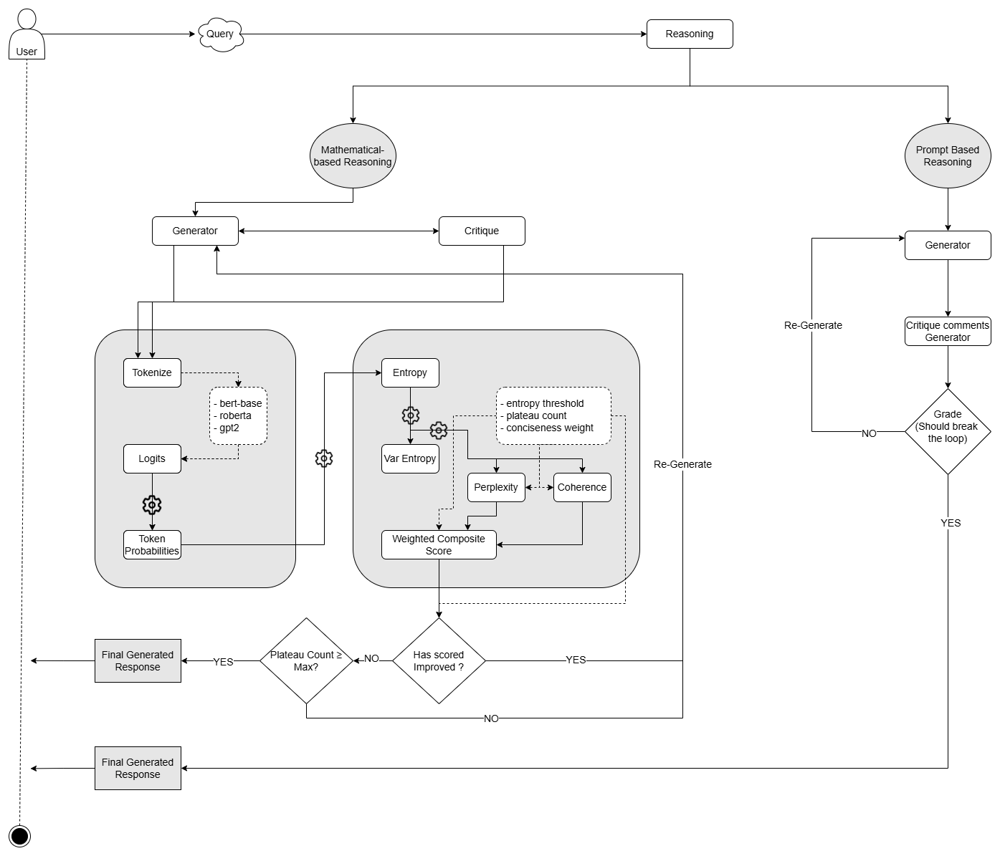

# Reasoning Module

The **Reasoning** folder contains modules that empower MASLibPy with advanced evaluation and refinement capabilities. These modules enable the framework to assess generated responses using both mathematical metrics and prompt-based approaches, and then combine these evaluations into composite scores. This functionality is essential for ensuring that agents provide accurate, coherent, and concise outputs.

**Note:**
  - Prompt-based reasoning is (~3-5x) **faster** than Mathematical-based reasoning.
  - Mathematical-based reasoning provides relatively **better responses** than Prompt-based reasoning.  
  
---

## File Overview

### 1. `mathematical.py`
This module provides the `Mathematical` class, which implements a mathematical reasoning strategy. It:
- **Loads multiple language models** (e.g., BERT, RoBERTa, GPT-2) and assigns them predefined weights.
- **Computes evaluation metrics** such as entropy, perplexity, variance of entropy (varentropy), and coherence using:
  - A softmax function to derive probabilities from logits.
  - Z-score normalization for the logits.
- **Calculates a composite score** based on these metrics to assess response quality.
- **Refines responses iteratively** by generating, critiquing, and revising outputs until a satisfactory score is reached.
- **Saves detailed logs and results** (including metrics and final responses) to a file for later review.

### 2. `prompt_based.py`
This module provides the `PromptBased` class, which uses a prompt-driven approach for reasoning. It:
- **Iteratively generates responses** using the language model.
- **Critiques and grades generated responses** by:
  - Generating critique comments to identify areas for improvement.
  - Grading the response based on criteria like accuracy, completeness, clarity, and relevance.
- **Terminates iterations** when the graded response meets all defined criteria.
- **Logs detailed outputs** for each iteration, which include generated responses, critique comments, and grading outcomes.

### 3. `scorer.py`
This module acts as a bridge between the two reasoning approaches:
- The `Scorer` class provides a unified interface to:
  - Invoke the **mathematical** reasoning method.
  - Invoke the **prompt-based** reasoning method.
- Depending on the agent’s configuration (e.g., `score_type`), the framework will select the appropriate reasoning strategy.

---

## How It Works

When an agent invokes its reasoning process, the system will:
1. **Generate an initial response** using the designated language model.
2. **Evaluate the response**:
   - With the **Mathematical** module, metrics such as entropy, perplexity, and coherence are calculated.
   - With the **Prompt-Based** module, the response is iteratively critiqued and refined based on user-defined prompts.
3. **Aggregate scores and metrics** to decide whether to accept the current response or to continue iterating.
4. **Save detailed logs** for debugging and analysis.

These processes ensure that the agents produce high-quality, reliable outputs that are both accurate and 

---

## Experimental Results & Optimal Configurations for Mathemaical-based reasoning

To optimize the **Mathematical Reasoning Module**, we conducted experiments with various configurations of key parameters:

| Config ID | Entropy Threshold | Max Plateau Count | Conciseness Weight | Max Iterations | Key Observations |
|-----------|------------------|--------------------|--------------------|----------------|------------------|
| A1        | 0.05             | 4                  | 0.4                | 6              | Good balance between completeness and conciseness. |
| A2        | 0.15             | 3                  | 0.4                | 5              | Improved conciseness, slightly better coherence. |
| B1        | 0.1              | 2                  | 0.4                | 5              | Best coherence score, achieving strong conciseness. |
| C1        | 0.1              | 3                  | 0.3                | 5              | Well-balanced output with retained key information. |
| D1        | 0.05             | 5                  | 0.5                | 8              | Good balance but required more iterations. |

**Key Takeaways:**
- **Lower entropy thresholds** (0.05 - 0.1) improve response refinement.
- **Lower plateau counts** (2-3) help achieve conciseness without overfitting.
- **Conciseness weight (0.4 - 0.5)** is crucial for balancing clarity and detail.

**For full experiment details**, refer to the full **[Experimental Report](../assets/MathematicalReasoning_Experimentations.pdf)**.

---

